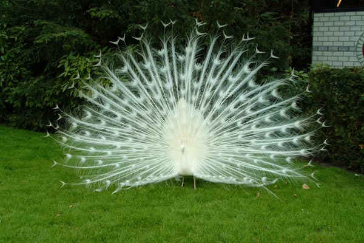
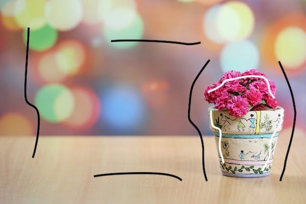

# 🖼️ Image Matting with A Closed Form Solution 

Image Matting is a crucial process in accurately estimating the foreground object in images and videos. It finds extensive applications in various domains, particularly in film production for creating visual effects.

## 📋 Overview
This project implements the "A Closed Form Solution to Natural Image Matting" method proposed by A. Levin, D. Lischinski, and Y. Weiss. The method was presented at the IEEE Conference on Computer Vision and Pattern Recognition (CVPR) in June 2006, New York.

The paper describing the method can be found [here](https://people.csail.mit.edu/alevin/papers/Matting-Levin-Lischinski-Weiss-CVPR06.pdf).
A detailed report of our work and implementation will be added soon...

## 💡 Purpose
The purpose of this project is to provide a Python implementation of the image matting technique . By implementing this method, users can accurately estimate foreground objects in images and videos, which can be beneficial for various image and video editing applications.
## 🌐 Online Demo
An online demo of this work is available at IPOL. Users can test the image matting algorithm with their own images through this interactive demo. There are some examples available on the website, or simply upload an image and the scribbles to the demo interface and observe the results of foreground and background estimation.

[Online Demo](https://ipolcore.ipol.im/demo/clientApp/demo.html?id=77777000489).
## 🛠️ Usage
To use this implementation, follow these steps:
1. Clone the repository to your local machine.
2. Install the necessary dependencies (if any).
3. Run the main script to perform image matting on your desired images.

After cloning the repository, run the following command in your terminal:

```bash
python main.py input_image.png -s scribbles.png -o output_alpha.png
```

## 📷 Example
Here is an example of input image, scribbles image, and the obtained result:


| Original image                           | Scribbled image                           | Output alpha                             | 
|------------------------------------------|-------------------------------------------|------------------------------------------|
|    |  |  |


## 📚 References

- A. Levin, D. Lischinski, and Y. Weiss. "A Closed Form Solution to Natural Image Matting". IEEE Conf. on Computer Vision and Pattern Recognition (CVPR), June 2006, New York. [Link to Paper](https://people.csail.mit.edu/alevin/papers/Matting-Levin-Lischinski-Weiss-CVPR06.pdf).
